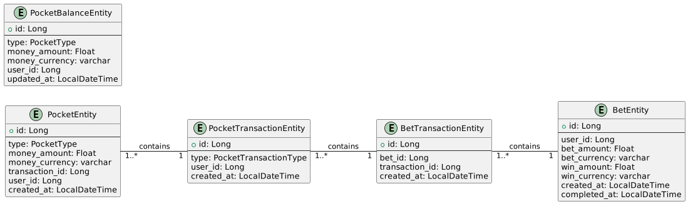
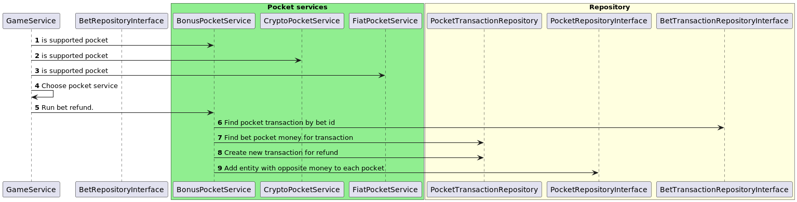

# Test pocket system
## Main class diagram

## Database diagram

## Sequence diagrams
### Bet

### Refund

### Bonus cancel

### Withdraw

## Draft code implementation
[Bonus service](src/main/java/org/example/service/pocket/BonusPocketService.java)

[Game service](src/main/java/org/example/service/GameService.java)
